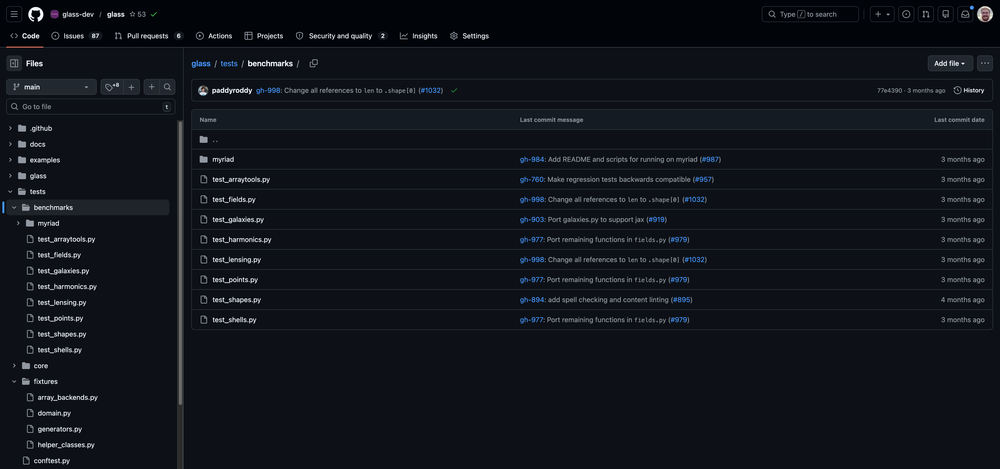







# How we used pytest-benchmark

## Overview

::: {.r-fit-text .columns}

::: {.column}

- Add benchmark tests alongside core-tests.
  - Reuse fixtures from core-tests.
- Minimise assertions to avoid flakiness.
- Only test for Numpy to begin with as that is all that existed before.
- Define Regression tests which compare BASE ref to HEAD ref for PRs.
  - Benchmark test code is defined in the HEAD ref.
  - Run in GitHub actions.
  - Both runs occur right after one another so in theory experience the same
    load on the machine.

:::

::: {.column}



:::

:::

## Regression Tests

Written using [Nox](https://nox.thea.codes/en/stable/), ran on pull-requests

```py {code-line-numbers="21-109|32-45|47-54|14-17|56-60|62-74|76-92|94-108"}

```

## issues

- If the GLASS api changed (i.e. new module) the regression tests would fail.
- Many false positives, we think - i.e. flaky.
  - Split benchmark-tests into stable and unstable.
    - Different regression test metrics.
  - Maximise problem size.
  - Filter to only run for NumPy.

# Conclusion

- Has definitely highlighted regressions.
- Not clear if it was worth it.
- We hope to use it in the future for…
  - Demonstrating GPU improvements.
  - Benchmarking on different machines.
